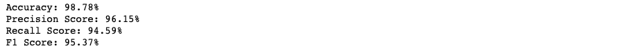

# Spam Detection using Naive Bays

## Introduction
Naive Bayes classifiers are a popular statistical technique of e-mail filtering. They typically use bag of words features to identify spam e-mail, an approach commonly used in text classification.
Naive Bayes classifiers work by correlating the use of tokens (typically words, or sometimes other things), with spam and non-spam e-mails and then using Bayes' theorem to calculate a probability that an email is or is not spam.
Naive Bayes spam filtering is a baseline technique for dealing with spam that can tailor itself to the email needs of individual users and give low false positive spam detection rates that are generally acceptable to users. It is one of the oldest ways of doing spam filtering, with roots in the 1990s. (Wikipedia)
We will be using the Naive Bayes algorithm to create a model that can classify dataset SMS messages as spam or not spam, based on the training we give to the model.

## Result
Below you can see two different messages which our model could correctly lable as spam or ham.
 
**An example of spam message:**

 
**An example of ham message:**

 
 
## Evaluation
Let's evaluate our model with 4 different metrics:

